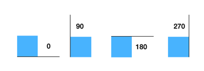
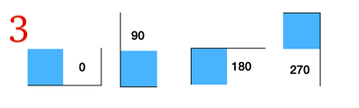
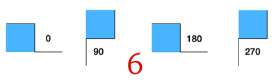

# 13sheep

This is a playable version of 13 sheep implemented in Javascript.

Instructions
------------

[13 Sheep](https://www.moritzdressler.de/en/13_Sheep) is a quick roll-and-write game for one or more players. By drawing fences on a grid, players try to protect as many sheep as possible before the wolf comes.

Each turn, players roll a die and draw a matching fence on the map. The original game can last for 7 to 10 rounds, depending on the result of the die roll in the last 3 rounds. You cannot overwrite fences already drawn, and you cannot build a fence on top of a bush (the wolf can, however, slide under a bush).

At the end of the game, each completely enclosed area will score the players points depending on the number of sheep within. When playing solo, players try to beat their own high score.

In this version of the game, you can choose the number of rounds, sheep, and bushes. The sheeps and bushes (denoted by red borders) will be placed randomly. Note that sometimes the actual number of sheep and bushes can be less than what you asked for because the random location generator may generate the same location more than once. This does not happen often!

Every time you roll a dice, you have to choose one of the orientations that come up. The pictures, like the one below, will show you what the fence will look like on the grid (the blue square represents the cell you click on). Note that for outcomes 5 and 6, the orientations 0 and 180 are the same, as are 90 and 270. If you would like to pass on a particular round (typically because there is no room to draw any of the fences), you can click on the "P" option. You can also just refresh the page to start over.

Credits
-------

You can find out more about 13 Sheep, the original roll-and-write game [here](https://www.moritzdressler.de/en/13_Sheep).

Much of the code in this implementation was generated by ChatGPT (GPT-v4), and some of it was enhanced and fixed by Ghostwriter on [repl.it](repl.it). You can find out more about the prompts used on this [blog](https://www.neeldhara.com/blog/13sheep).

Find the source on [Github](https://www.github.com/neeldhara/13sheep). The sheep and wolf icons are from [Flaticon](https://www.flaticon.com/). This website is hosted by [Netlify](https://www.netlify.com/).

Much thanks to Jyothi from the Center for Creative Learning at IIT Gandhinagar for introducing me to this game!

Fence Shapes
------------

---

---

---

---

---

